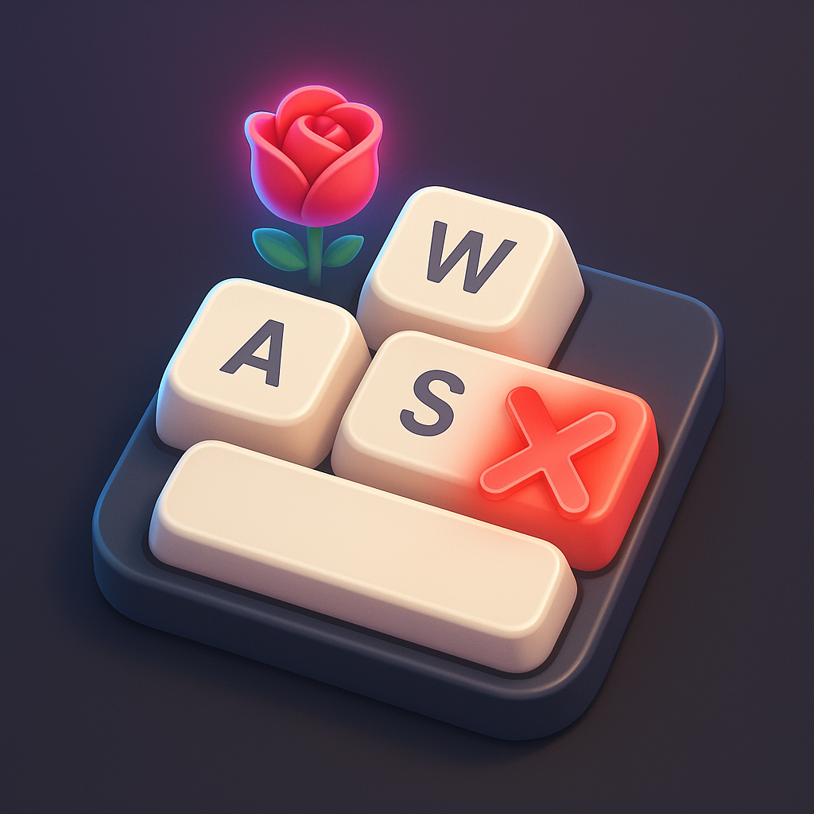

<p align="center">
  
</p>

<h1 align="center">Interactive Keyboard</h1>

<p align="center">
Transparentes 1:1 (500×500) Overlay für TikTok-Live-Streams. Zuschauer können per
HTTP-Webhook einzelne Tasten (WASD + Space, erweiterbar) zeitweise blockieren —
die App schluckt die Tasten systemweit und zeigt das visuell mit rotem X, Timer
und TikTok-Gift-Icon pro Taste.
</p>

<p align="center">
Für Windows.
</p>

---

## Features

- **Webhook-Server** (axum, Default Port 8080)
  - `GET /block?key=W&duration=10` — Taste W für 10 Sek blockieren
  - `GET /unblock?key=W` — Sperre sofort aufheben
  - `GET /reset` — alle Sperren aufheben
  - `GET /status` — JSON-Snapshot
  - Auch per VK-Code: `/block?vk=87&duration=10`
  - Shortcut-Form: `/w?duration=10`
- **Transparentes 1:1-Fenster**, fix auf Aspect-Ratio gelockt
- **Design-Modus (D)** — pro Taste: Farben, Border-Radius, Schriftgröße, Gewicht, Letter-Spacing
- **Edit-Modus (E)** — pro Taste: Position des Gift-Icons relativ zur Tastenmitte verschieben + skalieren
- **ESC-Menü** mit Settings (Webhook, Tasten, Audio, Block-Verhalten, Updates, Reset)
- **Mehrfach-Trigger-Verhalten** wählbar: addieren / zurücksetzen / ignorieren
- **TikTok-Gift-Bibliothek** mit ~500 Geschenken (catalog.json + WebP-Sprites)
- **Sound-System** mit per-Taste-Override (Block / Unblock) + globalem Default
- **Auto-Update** via GitHub Releases + Tauri Updater mit minisign-Signatur
- **NSIS-Installer** für Windows, via GitHub Actions

## Schnellstart (Dev)

```powershell
npm install
npm run start          # Tauri-Dev (Vite + Rust)
```

App startet → Webhook-Server lauscht auf `http://127.0.0.1:8080`. Test im
Browser: `http://127.0.0.1:8080/w?duration=5` → die W-Taste wird 5 Sekunden
blockiert.

## Release

1. Version in den vier Stellen hochsetzen:
   - `package.json`
   - `src-tauri/Cargo.toml`
   - `src-tauri/tauri.conf.json`
   - `src/lib/version.ts`
2. Commit + Tag:
   ```powershell
   git commit -am "Bump v0.2.0"
   git tag v0.2.0
   git push origin main --tags
   ```
3. GitHub Actions baut den NSIS-Installer + signiertes `latest.json` und legt
   ein Draft-Release an → veröffentlicht es nach erfolgreichem Build automatisch.

## Anti-Cheat-Schutz

Die App erkennt bekannte Anti-Cheats (Vanguard, EAC, BattlEye, FACEIT) und
**verwirft** Block-Requests, wenn einer läuft. Damit wird kein Hook in einer
Anti-Cheat-Umgebung gesetzt → kein Ban-Risiko durch dieses Tool.

## Webhook-Beispiele

```bash
# Taste W 30 Sekunden blockieren
curl "http://127.0.0.1:8080/block?key=W&duration=30"

# Identisch, kurzform
curl "http://127.0.0.1:8080/w?duration=30"

# Per ms
curl "http://127.0.0.1:8080/block?key=Space&ms=2500"

# Alles aufheben
curl "http://127.0.0.1:8080/reset"
```

## Lizenz

Privates Projekt.
